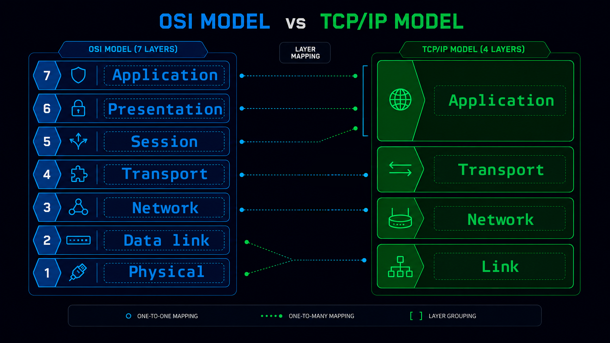
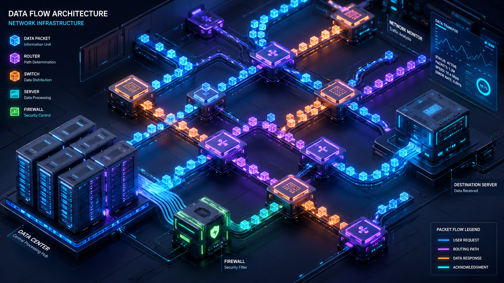
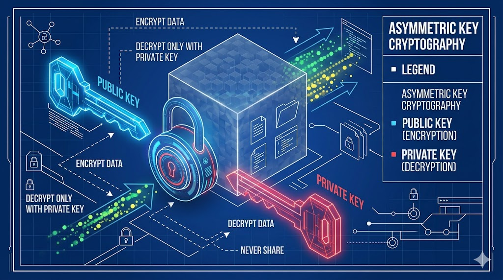
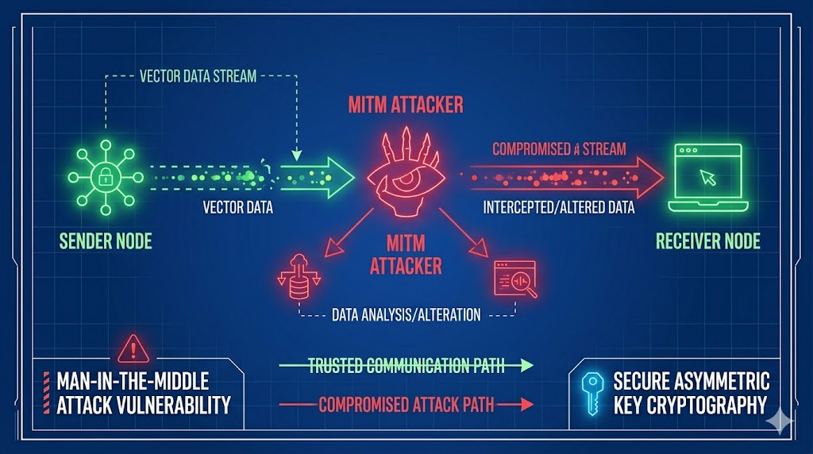
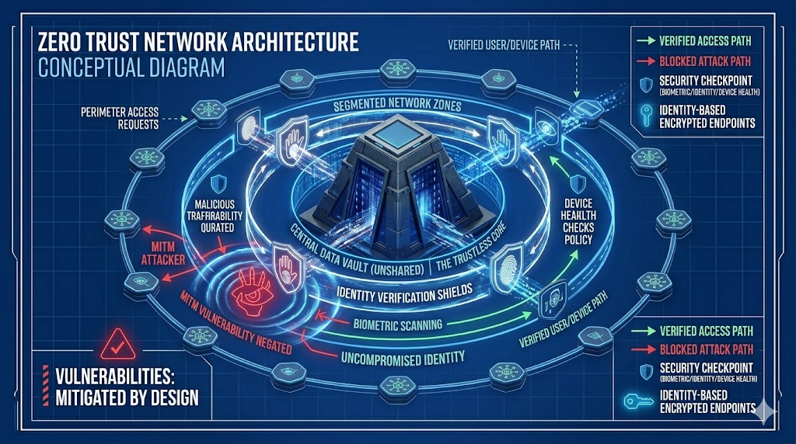

# Принципи роботи комп'ютерних мереж та захист даних

Інтернет — це не магія, а суворий набір правил, протоколів і фізичних кабелів, прокладених дном океанів. Щоб розуміти, як захищати інформацію, потрібно спочатку зрозуміти, як саме вона подорожує від вашого смартфона до серверів на іншому континенті.

## 1. Фундамент: Як дані подорожують світом

Коли ви відправляєте повідомлення, воно не летить суцільним шматком. Воно нарізається на дрібні фрагменти — **пакети**. Щоб ці пакети не загубилися, інженери створили багаторівневі моделі мережевої взаємодії.

### Моделі OSI та TCP/IP

*Рис. 1. Ієрархія рівнів абстракції: від фізичного кабелю до вашого браузера.*

**Еталонна модель OSI** складається з 7 рівнів. На практиці ж сучасний інтернет працює на базі простішої **моделі TCP/IP** (4 рівні).

| Рівень TCP/IP | Рівень OSI (відповідність) | Завдання рівня | Приклади протоколів |
|---|---|---|---|
| **Прикладний** | 7. Прикладний, 6. Представлення, 5. Сеансовий | Взаємодія з користувачем та додатками. | HTTP, HTTPS, FTP, DNS |
| **Транспортний** | 4. Транспортний | Встановлення зв'язку та контроль доставки. | TCP, UDP |
| **Мережевий** | 3. Мережевий | Маршрутизація пакетів (пошук шляху). | IPv4, IPv6, ICMP |
| **Канальний** | 2. Канальний, 1. Фізичний | Фізична передача сигналів (кабелі, Wi-Fi). | Ethernet, 802.11, MAC |

### Адресація: IP, MAC та DNS

*Рис. 2. Маршрутизатори аналізують IP-адреси та спрямовують пакети найшвидшим шляхом.*

Щоб пакет знайшов адресата, йому потрібні координати:
*   **IP-адреса (логічна):** Видається провайдером. Оскільки старі адреси (IPv4) майже закінчилися, світ переходить на новий стандарт IPv6.
*   **MAC-адреса (фізична):** Вшита в мережеву карту пристрою на заводі. Це "відбиток пальця" вашого заліза.
*   **DNS (Domain Name System):** Працює як телефонна книга, перекладаючи зрозуміле `google.com` у машинні цифри (IP).

---

## 2. Транспорт і Програми: Гарантії доставки

На транспортному рівні дані передаються двома основними протоколами:
*   **TCP:** Гарантує доставку. Перевіряє кожен пакет. Повільніше, але надійно (завантаження файлів, веб).
*   **UDP:** Відправляє і забуває. Дуже швидко, але з втратами (стрімінг, онлайн-ігри).

---

## 3. Криптографія: Захист даних у відкритому середовищі

Якщо трафік не зашифрувати, будь-хто на шляху від вас до сервера зможе його прочитати.

*Рис. 3. Асиметрична криптографія: відкритий ключ замикає дані, а закритий — відмикає.*

*   **Симетричне шифрування (AES):** Використовує один ключ. Швидко, але є ризик перехоплення ключа під час передачі.
*   **Асиметричне шифрування (RSA):** Використовує пару. **Відкритий ключ** ви роздаєте всім — ним зашифровують повідомлення для вас. **Закритий ключ** зберігається тільки у вас — ним ви розшифровуєте отримане.
*   **Хешування (SHA-256):** Процес перетворення даних у рядок фіксованої довжини без можливості зворотного розшифрування. Використовується для зберігання паролів.

---

## 4. Архітектура кібербезпеки та сучасні загрози

Захист інформації сьогодні — це комплексна інженерна архітектура.

*Рис. 4. Схема перехоплення трафіку (MITM) у незахищеній мережі.*

### Основні вектори атак
1.  **DDoS:** Перевантаження сервера мільйонами фальшивих запитів.
2.  **MITM (Man-in-the-Middle):** Непомітне перехоплення трафіку між клієнтом і сервером.
3.  **Фішинг:** Соціальна інженерія, часто з використанням генеративного ШІ для створення ідеальних текстів імітації.

### Методи захисту

*Рис. 5. Парадигма Zero Trust: відсутність довіри за замовчуванням до будь-якого пристрою.*

*   **VPN:** Зашифрований тунель між вами та інтернетом.
*   **Zero Trust (Нульова довіра):** Головне правило: "Ніколи не довіряй, завжди перевіряй". Система постійно вимагає підтвердження прав доступу, навіть якщо пристрій вже знаходиться у внутрішній корпоративній мережі.
